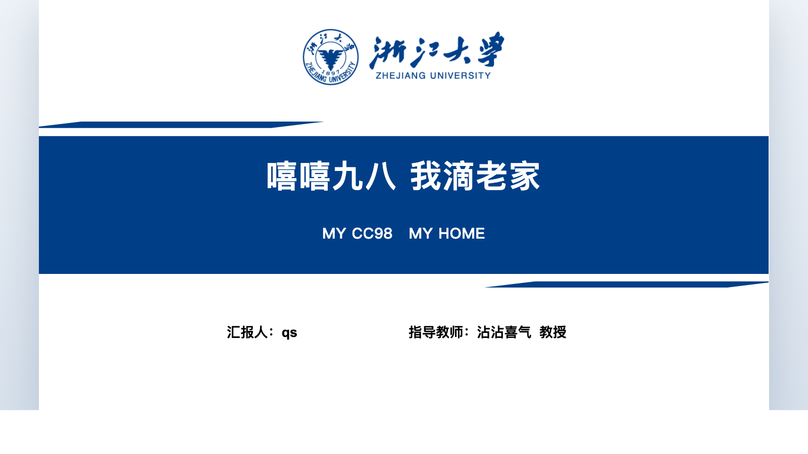
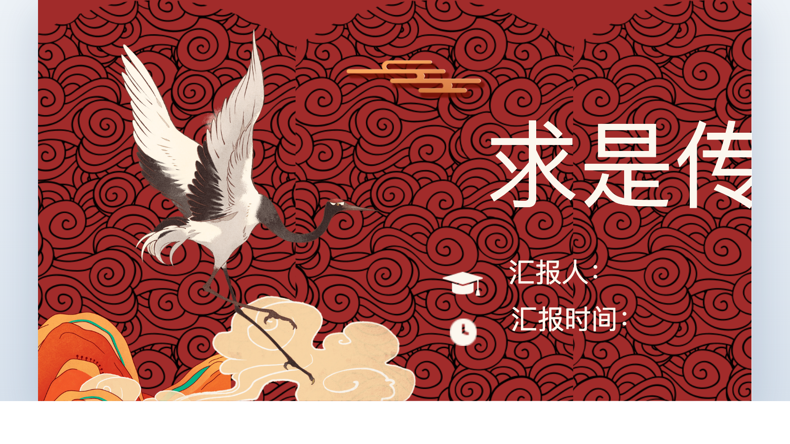
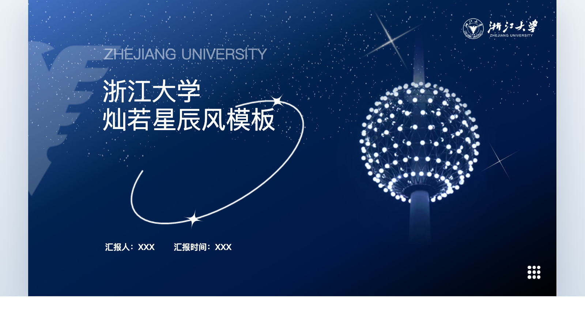
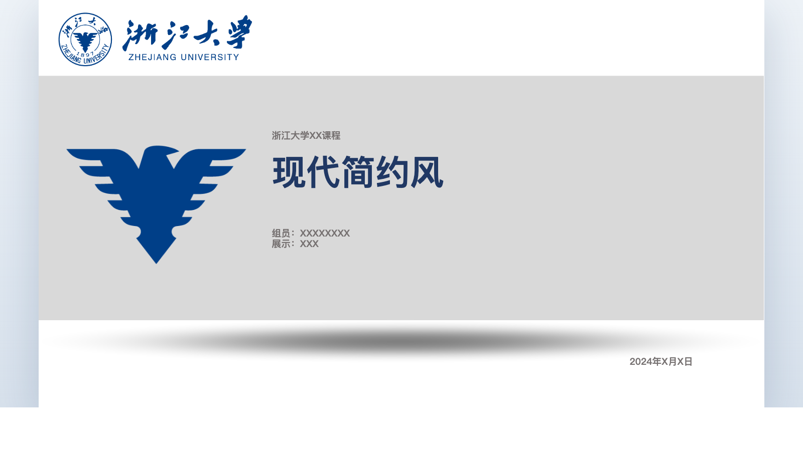
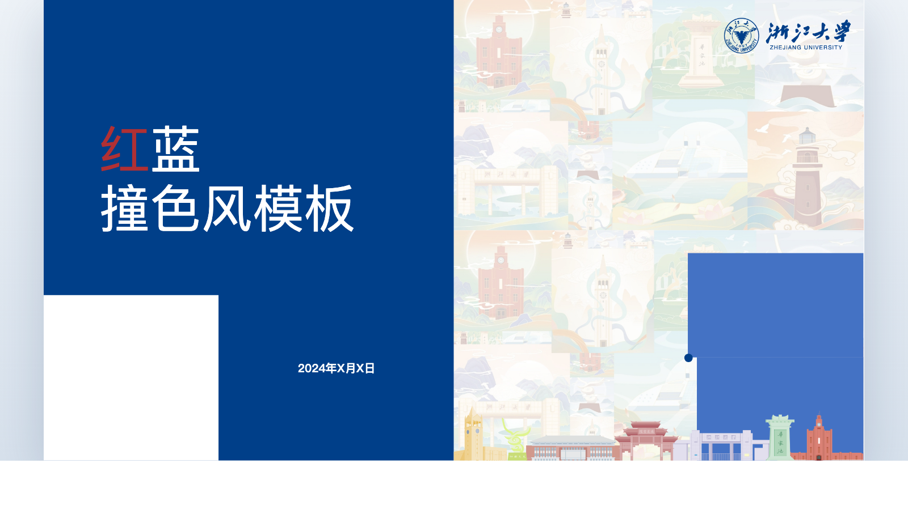

# 浙江大学 HTML PPT 模版合集

这个仓库收录了 5 套可修改的 HTML PPT 模版，均由原始 `.pptx` 转换而来，尽量保留版式、文字、图片和配色，而不是把每一页做成整页截图。

## 使用方式

- 打开对应模版目录下的 `index.html` 即可预览和修改
- 支持 `ArrowLeft` / `ArrowRight`、`PageUp` / `PageDown`、`Home`、`End`
- GitHub 页面主要用于浏览文件和查看封面，实际使用建议在本地浏览器里打开

## 模版列表

### 1. templet2

目录：[templates/templet2-html-ppt-template](templates/templet2-html-ppt-template)

### 2. 求是传承风

目录：[templates/求是传承风模板-html](templates/求是传承风模板-html)

### 3. 灿若星辰风

目录：[templates/灿若星辰风模板-html](templates/灿若星辰风模板-html)

### 4. 现代简约风

目录：[templates/现代简约风模板-html](templates/现代简约风模板-html)

### 5. 红蓝撞色风

目录：[templates/红蓝撞色风模板-html](templates/红蓝撞色风模板-html)

